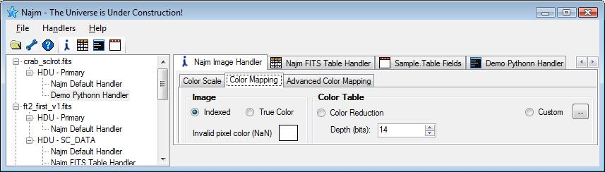

# Najm Handlers

According to Najm terminology, a Handler is the component that process the data in a FITS  file, or to be accurate, a FITS Header and Data Unit (HDU). Najm comes with four built in Handlers and two sample handlers written in python to help you develop yours. When Najm starts, it will load all handlers registered. For each handler you’ll see a button on the handlers toolbar—see fig. below.

{: .center-image}

Typically, you’ll select an HDU from the left side tree view then click the handler’s button to invoke a handler for this HDU. Once invoked, a handler will have full access to the data in this HDU and—through the Najm.FITS library—it has access to the FITS file and all other HDUs that might exist.

   For each invoked handler you should notice two UI elements created (and managed) by Najm main application:
   - A tab will be created on the panel at the right side of the interface. This tab will have all UI elements needed for this handler. You can also have more panels outside this tab (Imaging handler do this as an example).
   - A child node will be created for a handler under the HDU node used to invoke it. You can use this node to close the handler once you’re done using it.

   Najm comes with integration library (Najm.Handlers.Integration.dll) that allows you to implement your handler in C# (or any CLR compatible language). Najm also comes with a built in Python handler that hosts IronPython and allows you to write your handler code in python! A template is provided to make this process even easier. Python handlers can be reloaded (by right clicking the Handler button) at runtime without the need to close the application making it very easy to debug and fix your code.

   Najm also comes with two python sample handlers. One of them is a command console that allow you to play with the FITS object model—a very convenient toy!

   See Najm Integration Manual for how to write your own handler (doesn't exist yet!)