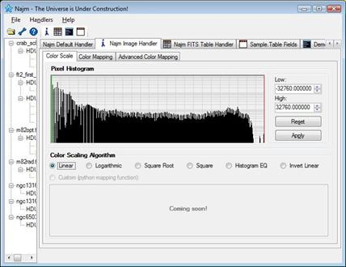
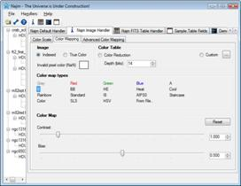
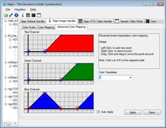

# Najm Image Handler

Imaging Handler is probably the most complex piece that comes with Najm. It is responsible for loading FITS image data for an object, creating a color scale and color map, then using them to create and display an image of the object.

### Color Scaling

Once you invoke Najm image handler you'll see the image along with its color histogram. Image Handler then allows you to choose your color scale from among several supported ones (linear, logarithmic, square root, square, histogram equalized, and invert linear). Next release of Najm will even allow you to create your own scaling algorithm in python (still under construction!).

     
    <a href='javascript:ViewImage("assets/images/ss.histo.jpg", "width=710,height=550")' style="text-decoration:none; font-weight:bold;" > click to enlarge </a> 

### Color Mapping

To be able to visualize astronomical images, you need to assign colors to data values in the image array, this is when color maps come handy. Najm Image Handler supports 18 different built in color maps, custom color maps loaded from text files, and a unique advanced color mapping technique that allows you to start from a built in color map and customize it using linear interpolation with a few mouse clicks. You can also control the contrast and bias of the result image

<table width="580" border="0" align="center">
    <tr>
    <td height="245">
        

             
            <a href='javascript:ViewImage("assets/images/ss.colormap.jpg", "width=710,height=550")' style="text-decoration:none; font-weight:bold; "> click to enlarge </a>
        

    </td>
    <td>
        

         
        <a href='javascript:ViewImage("assets/images/ss.advcolormap.jpg", "width=710,height=550")' style="text-decoration:none; font-weight:bold; "> click to enlarge </a>
        

    </td>
    </tr>
</table>

    Color mappColor mapping (Lefft) and Advanced Color map customization Right)
    

Figure below shows a bizarre image for M82 (Cigar Galaxy) which uses a color map created using Najm advanced color mapping feature:

{: .center-image}
