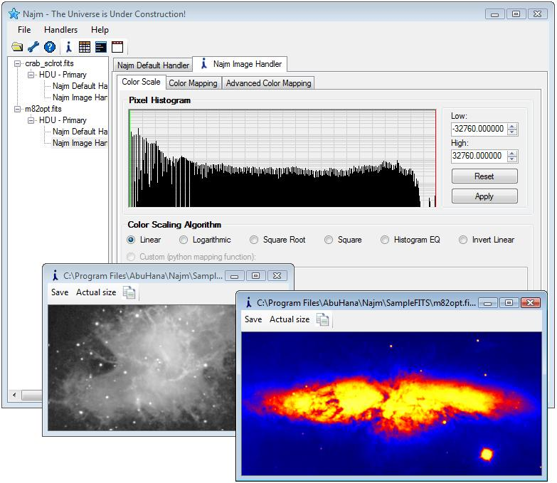

# About Najm

Najm is a software framework designed to help astronomers and astrophysicists to easily access and process the contents of FITS files. Processing FITS files is called handling in Najm terminology. Najm comes with 6 built in handlers and can be extended by adding more handlers that implement your custom processing code.

{: .center-image}

Najm started as an independent study project for my Master’s degree when I joined the Fermi Gamma-ray space telescope research group at the University of Washington.

From being just a tool to explore FITS files at its early stages, Najm evolved to an extensible framework due to different feature requests I got from my supervisor (Prof. Toby Burnett) and his graduate students (Eric, Marshall, and Matthew). Crurrent release of Najm allows you to do the following:

   - Inspect FITS file headers: As a framework, It provides you with a complete library for accessing FITS files’ headers and data units.
   - Create FITS Images, create and apply different color scales/maps to it, zoom and pan through large images, copy to clipboard, and save to files.
   - Display tabular data for FITS tables—including both binary and ASCII tables and allow you to use this data with your favorite spreadsheet application.
   - Using Najm.FITS library, you can extend its functionality by writing your custom handler. You can implement your handler using C# (or any CLR compatible language) or even python (iron python is hosted to allow for full utilization of Microsoft .NET Framework)

Najm is still being evolved and more features are being added to it including WCS support, custom color mapping, full FITS IO support, and more.

Please go ahead and download the beta release by clicking download link. And don’t forget to send [me](mailto:menein@uw.edu) your feedback and comments.