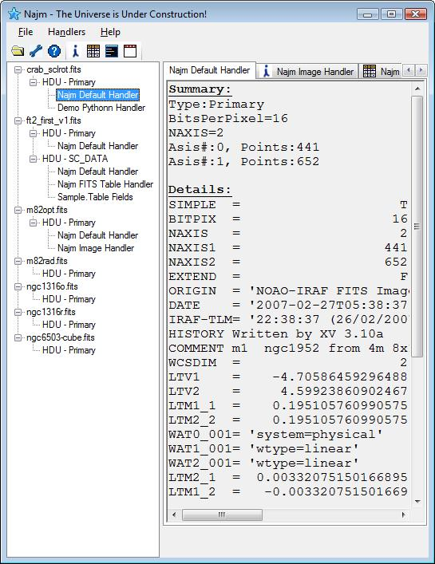

# Default Handler

FITS files' header contains a lot of useful information about the nature of the data stored in the file. Examples are Name of astronomical object, number of axes represents the data, units, instrument used, world coordinate system (WCS) information, comments, and more. Being able to see this data is very important that Najm do this by default.

When you select a FITS HDU, Najm will invoke the Default handler right away. This handler will display the Header of the selected HDU (each card image on a line) along with a summary of its contents allowing you to know the contents of the file at a glance. You can’t close this handler or unload it. Default handler hence has no invoke button.

{: .center-image}