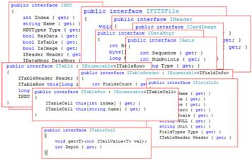

# Najm FITS Library

Najm comes with a FITS IO library that allows you to open and read FITS files. It supports different types of HDUs including primary images, image extensions, binary tables, ASCII tables, heap data, and limited support for random groups. Writing FITS is not yet supported.

{: .center-image}

This library has two parts, First (Najm.FITSC.DLL) written in C++ allowing you to use it with your C++ code. The second part (Najm.FITS.DLL) is built on top of the first and is implemented in C#. Najm Main Application is written in C# and uses the C# FITS IO library.

<table align="right">
    <tr> 
        <td>
        
        </td>
    </tr>
    <tr>
        <td align="center">
        <a href='javascript:ViewImage("assets/images/ss.fitsom.jpg", "width=1449,height=928")' style="text-decoration:none; font-weight:bold; font-size:12px"> click to enlarge </a>
        </td>
    </tr>
</table>

When you open a FITS file, Najm displays its name in a tree structure with the HDUs as child nodes. Typically, you’ll select an HDU and invoke a handler to process it. This figure shows a snapshot of the object model exposed from Najm.FITS.

Complete interface can be found [here](ifits).