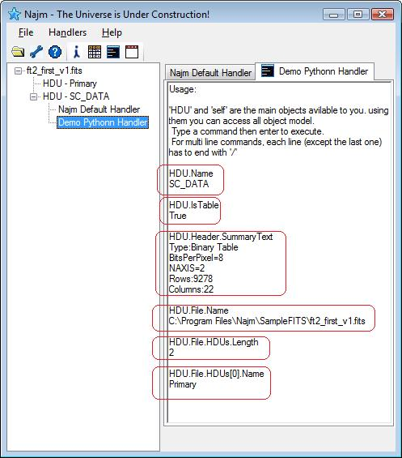

# Najm Python Handler

To make it easy for python gurus (most of today's astronomers and astrophysicists are!) to use their favorite language and write a Najm Handler in python, I created a Wrapper Handler that hosts python engine, implements most of the functionality required for handlers and leaves minimal tasks to be implemented by you, python developer. Sometimes I refere to this handler as python handler - a confusing name!

This handler is written in C# and here is the reason of the confusion. It is implemented in C# to let you implement your handler in python! Any time you add a python handler to Najm (see documentation for how to do this), this python wrapper is added instead and your python coded handler is then passed to it for execution.

Python coded handlers are easy to implement. A template is provided and all what you need to do is to write the body of a few functions. You can easily modify your code and reload it without need to rebuild or even restart Najm, just right click the handler button and it will ask you if you want to reload it or not. This makes debugging your code an easy task.

Two sample python handlers are provided:
- TableFields: Displays the names of the fields in a FITS table and demonstrates how to implement a handler in python and how to use FITS object model.
- Console: A very nice handler that shows you how to hook to WinForms events and do some simple UI tasks in python. It exposes the FITS object model (through HDU object) and allows you to invoke immediate code against it.

Following snapshot shows the console handler and highlights some invoked commands along with the result of their execution.

{: .center-image}