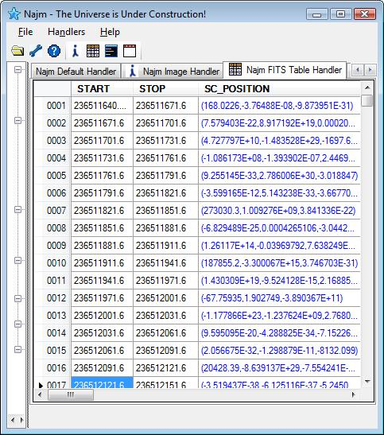

# Najm Table Handler

Yet another example of what can be done using Najm handler is the Table Handler. This handler simply displays tabular data for FITS tables whether it is a Binary table or an ASCII table. Cells can have both scalar and vector types of data. Vector cells will be drawn in different color to be easily recognized.

FITS tables are a very important type of data used by astronomer and astrophysicists. They can contain things like catalogs, time tables, pixel coordinats, photon counts...etc. The screenshot below shows an example of a table populated with actual data from Fermi Gamma Ray Space Telescope as displayed by Najm Table handler.

{: .center-image}
